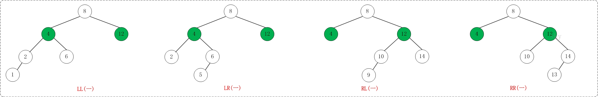
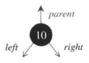
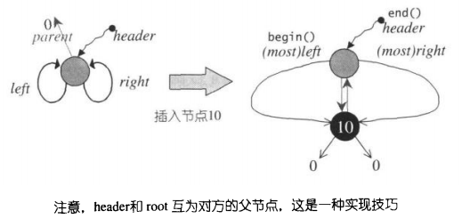
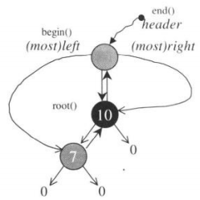

## AVL Tree

AVL 树本质上是一棵平衡二叉搜索树，其平衡条件是每个结点的左右子树的高度之差的绝对值（平衡因子）最多为 1。

在大量的随机数据中，AVL 树表现要好很多。

AVL 树查找、插入和删除在平均和最坏情况下都是 O(logN)，增加和删除可能需要通过一次或多次树旋转来重新平衡这个树。

### 四种情况导致二叉搜索树不平衡



* LL：LeftLeft，也称为"左左"。插入或删除一个节点后，根节点的左子树的左子树还有非空子节点，导致"根的左子树的高度"比"根的右子树的高度"大2，导致AVL树失去了平衡。

* LR：LeftRight，也称为"左右"。插入或删除一个节点后，根节点的左子树的右子树还有非空子节点，导致"根的左子树的高度"比"根的右子树的高度"大2，导致AVL树失去了平衡。

* RL：RightLeft，称为"右左"。插入或删除一个节点后，根节点的右子树的左子树还有非空子节点，导致"根的右子树的高度"比"根的左子树的高度"大2，导致AVL树失去了平衡。

* RL：RightRight，称为"右右"。插入或删除一个节点后，根节点的右子树的右子树还有非空子节点，导致"根的右子树的高度"比"根的左子树的高度"大2，导致AVL树失去了平衡。

### AVL 树的基本数据结构

**AVL 树的节点：**



```c++
    template<class Value>
    struct __AVLTree_node {
        Value val;
        long long height;  //高度
        __AVLTree_node* left;
        __AVLTree_node* right;
        __AVLTree_node* parent;

        //求该子树上的最小值
        static __AVLTree_node* minimum(__AVLTree_node* x) {
            //一直向左走
            while(x->left) x=x->left;
            return x;
        }
        //求该子树上的最大值
        static __AVLTree_node* maximum(__AVLTree_node* x) {
            while(x->right) x=x->right;
            return x;
        }
    };
```

另：关于节点的高度定义

> 叶子节点高度为0，某节点的高度为max(其左右子节点高度)+1，同时，header的height设为-1，此值无意义，但可以用来标识header节点（iterator::operator--()中有用到）

**AVL 树的迭代器：**

​		双向迭代器，包含operator++() 和 operator--()操作

```c++
    template<class Value>
    struct __AVLTree_iterator {
        using iterator = __AVLTree_iterator<Value>;
        using node = __AVLTree_node<Value>;

        //双向迭代器
        using iterator_category = bidirectional_iterator_tag;
        using value_type = Value;
        using difference_type = ptrdiff_t;
        using size_type = size_t;
        using reference = Value&;  
        using pointer = Value*;
		//迭代器类中的主要数据成员
        node *cur;
    }
```

**AVL树**

```c++
template<class Key, class Value, class KeyOfValue,
             class Compare, template <class T> class Alloc=allocator>
    class AVLTree {
    public:
        using key_type = Key;
        using value_type = Value;

        using size_type = size_t;
        using difference_type = ptrdiff_t;
        using pointer = value_type*;
        using const_pointer = const value_type*;
        using reference = value_type&;
        using const_reference = const value_type&;
    protected:
        using node = __AVLTree_node<Value>;
        //节点的空间配置器
        using node_allocator = allocator<node>;

		//AVLTree类中的主要数据成员
        size_type node_count;
        node* header;
    }
```

AVL 树具体结构如下：

​		树状结构的各种操作（例如iterator::operator++()、iterator::operator--()等操作），最需注意的就是边界情况的发生，也就是走到根节点时要有特殊的处理，因此，特别为根节点root再设计了一个父节点header，下图左为AVLTree的初始状态，图右为加入第一个节点后的状态，无论是插入节点或删除节点等操作，需要时刻维护header的正确性，使其父节点指向根节点root，左子节点指向最小节点，右子节点指向最大节点。（`end().cur=header`  `begin().cur=header->left`）



再插入一个节点7后：



### AVL 树的旋转操作

针对四种情况可能导致的不平衡，可以通过旋转使之变平衡：


* 对于LL旋转，你可以这样理解为：LL旋转是围绕"失去平衡的AVL根节点"进行的，也就是节点k2；而且由于是LL情况，即左左情况，就用手抓着"左孩子，即k1"使劲摇。将k1变成根节点，k2变成k1的右子树，"k1的右子树"变成"k2的左子树"。

  ```c++
  /*
   * LL：左左对应的情况(左单旋转)。
   *
   * 返回值：旋转后的根节点
   */
  template <class T>
  AVLTreeNode<T>* AVLTree<T>::leftLeftRotation(AVLTreeNode<T>* k2)
  {
      AVLTreeNode<T>* k1;
  
      k1 = k2->left;
      k2->left = k1->right;
      k1->right = k2;
      //另：k1和k2的parent指向也需要改变
      k1->parent = k2->parent;
      k2->parent = k1;
      if(nullptr != k2->left) k2->left->parent = k2;
  
      k2->height = max( height(k2->left), height(k2->right)) + 1;
      k1->height = max( height(k1->left), k2->height) + 1;
  
      return k1;
  }
  ```


* RR是与LL对称的情况，**RR旋转也只需要一次即可完成。**

  ```c++
  /*
   * RR：右右对应的情况(右单旋转)。
   *
   * 返回值：旋转后的根节点
   */
  template <class T>
  AVLTreeNode<T>* AVLTree<T>::rightRightRotation(AVLTreeNode<T>* k1)
  {
      AVLTreeNode<T>* k2;
  
      k2 = k1->right;
      k1->right = k2->left;
      k2->left = k1;
      //parent
      k2->parent = k1->parent;
      k1->parent = k2;
      if(nullptr != k1->right) k1->right->parent = k1;
  
      k1->height = max( height(k1->left), height(k1->right)) + 1;
      k2->height = max( height(k2->right), k1->height) + 1;
  
      return k2;
  }
  ```


* LR失去平衡的情况，需要经过两次旋转才能让AVL树恢复平衡。**第一次旋转是围绕"k1"进行的"RR旋转"，第二次是围绕"k3"进行的"LL旋转"。**

  ```c++
  /*
   * LR：左右对应的情况(左双旋转)。
   *
   * 返回值：旋转后的根节点
   */
  template <class T>
  AVLTreeNode<T>* AVLTree<T>::leftRightRotation(AVLTreeNode<T>* k3)
  {
      k3->left = rightRightRotation(k3->left);
  
      return leftLeftRotation(k3);
  }
  ```


* RL是与LR的对称情况！**第一次旋转是围绕"k3"进行的"LL旋转"，第二次是围绕"k1"进行的"RR旋转"。**

  ```c++
  /*
   * RL：右左对应的情况(右双旋转)。
   *
   * 返回值：旋转后的根节点
   */
  template <class T>
  AVLTreeNode<T>* AVLTree<T>::rightLeftRotation(AVLTreeNode<T>* k1)
  {
      k1->right = leftLeftRotation(k1->right);
  
      return rightRightRotation(k1);
  }
  ```

## 参考资料

* https://www.cnblogs.com/skywang12345/p/3577360.html
* https://vegchic.github.io/2017/10/26/AVL%E6%A0%91%E7%AE%80%E4%BB%8B%E5%8F%8AC++%E5%AE%9E%E7%8E%B0/
